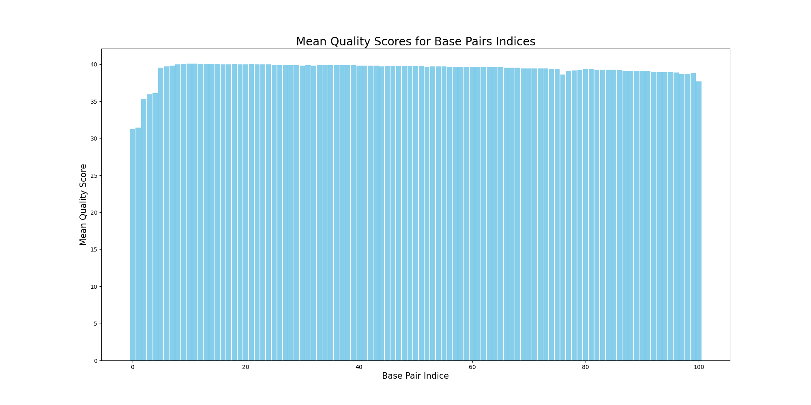
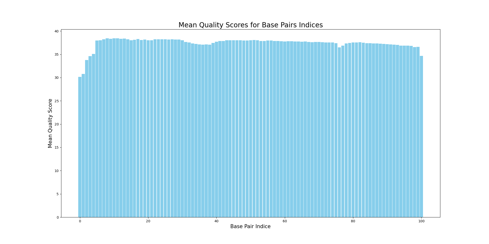

# Assignment the First

## Part 1
1. Be sure to upload your Python script.

| File name | Label | Read length | Phred encoding |
|---|---|---|---|
| 1294_S1_L008_R1_001.fastq.gz | Read 1 | 101 | +33  |
| 1294_S1_L008_R2_001.fastq.gz | Index 1 | 8 | +33 |
| 1294_S1_L008_R3_001.fastq.gz | Index 2 | 8 | +33 |
| 1294_S1_L008_R4_001.fastq.gz | Read 2 | 101 | +33 |

2. Per-base NT distribution
    1. Use markdown to insert your 4 histograms here.
    2. **Read1**
    
    3. **Index1**
    
    4. **Index2**
    
    5. **Read2**
    
    
## Part 2
1. Define the problem

**We need to ensure that the reads have valid matching indexes, and filter out data where index hopping occurred and/or low quality data.**

2. Describe output

**It will output 52 files, 24 for read 1 with matching indexes, 24 for read 2 with matching indexes, 1 for read 1 unmatching indexes, 1 for read 2 unmatching indexes, 1 for read 1 unknown or low quality, and 1 for read2 unknown or low quality. It will return the counts of records for matching indexes, unmatching indexes and unknown or low quality indexes.**

3. Upload your [4 input FASTQ files](../TEST-input_FASTQ) and your [>=6 expected output FASTQ files](../TEST-output_FASTQ).
4. Pseudocode
**list? list of known indexes; need seq and phred lines**
**have to decide if qual score per nuc or not, justify; if one bad score one pos, do we throw away everything? qual score mode**

**do per base of qual score of index, if any are too low discard; only 8 bases; also toss if only one N; if any sort of error than its low quality, average may skew it**

<!-- Create two lists, one with the 24 known indexes one with the 24 known index reverse complements,
using the reverse complement function. -->

if key matches value

rev comp index 2 in header to see it matches

Create a dictionary of known indexes, with the keys as the known indexes and values as the reverse complements of the known indexes.

Open all 4 input FASTQ files, read each line by line. 
    for each record, look at lines 1-4
        check if quality score is less than cutoff of 30
            if less than cutoff, write to unknown file
        iterate over the index dict, see if index1 matches a key of the index dict
            if index1 not a key
                write to unknown file
            if index1 is a key
                see if index2 matches a value of the index dict
                    if index2 is not a value
                        write to unknown file
                    if index2 is not a value but not linked to same key index
                        write to unmatched file
                    index2 is value of index1
                        write to matched file

        make header 

    
    if it doesn't, check if quality score is less than cutoff of 30

        then see if index2 matches the values of the index dict.
            check q score
                if index
        see if key = value
    read sequence line of the nth record for all FASTQ files
    
    
    if individual qscore in index doesn't meet quality score cutoff, write to unknown file
    if index contains N, write to unknown file


    add index1 and rev comp index2 to header
    if (avg qscore of index) doesn't meet quality score cutoff


    when naming files with indexes, only for matching


```make set of 24 known forward indexes
<!-- make set of 24 index reverse complements -->

Open all 4 input FASTQ files, read each line by line. 
    for each record, look at lines 1-4, make an array for each line
        check if index1 in known set
            if not in known set
                rev comp index 2, modify header so it has index1 and index2 
                write to unknown file
                increment unknown counter
            if index 1 in known set
                save rev comp of index2 to variable
                check if rev comp index 2 variable in known set
                    if rev comp index2 variable not in known set
                        modify header so it has index1 and index2 rev comp variable
                        send to unknown
                        increment unknown counter
                    if in set,
                        check if quality score in line 4 for index1 is less than cutoff of 30
                        if less than cutoff, 
                            modify header so it has index1 and index2 rev comp
                            write to unknown file
                            increment unknown counter
                        check if quality score in line 4 for index2 is less than cutoff of 30
                        if less than cutoff, 
                            modify header so it has index1 and index2 rev comp
                            write to unknown file
                            increment unknown counter
                        check if index1 is equal to rev comp index2 var
                            modify header so it has index1 and index2 rev comp variable
                            write to matched
                            increment matched counter
                        if index1 not equal to rev comp index2 var
                            modify header so it has index1 and index2 rev comp variable
                            write to unmatched
                            increment unmatched counter```

only change header when writing out to file
array[0] = array[0] + index1 + rev comp index2             
        

the arrays will empty each time
read 1
[header seq  + Q]
read 2
array is only to write to file
change header line of array to @header_index1_revcompindex2


5. High level functions. For each function, be sure to include:
    1. Description/doc string
    2. Function headers (name and parameters)
    3. Test examples for individual functions
    4. Return statement

def convert_phred(letter):
    ```
    Takes in a letter and converts it into a phred score, which is returned.
    ```
    return score


def reverse_complement(str):
    ```
    Takes in a string of a sequence, and returns the reverse
    complement of the sequence in a new string.
    ```
    return rev_str


def modify_header(line_1, index_1, index_2)
    ```
    Takes in the first line of the record (the header line)
    and index 1 and index 2. Converts index 2 to its reverse
    complement, and adds index 1 and the reverse compliment of 
    index 2 to the end of the line_1 header. Returns the new header.
    ```
    return labeled_header


def get_record(file):
    ```
    Takes in a file, and saves the 4 lines of a record as 4
    variables, which are returned.
    ```
    return line1, line2, line3, line4


def write_out(filename, line_1, line_2, line_3, line_4):
    ```
    Takes in a filename to write out to, and the
    4 lines of the record that will be written out. 
    Writes out the record to the specificed output file.
    Does not return anything.```


check n in unit test?

